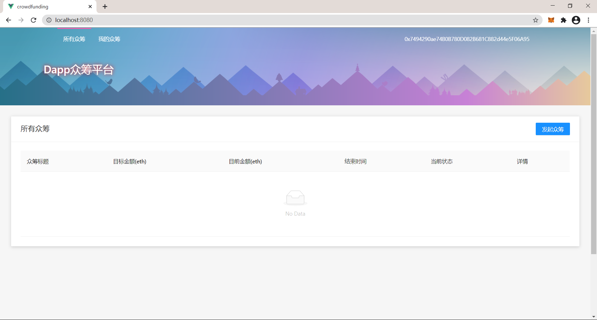
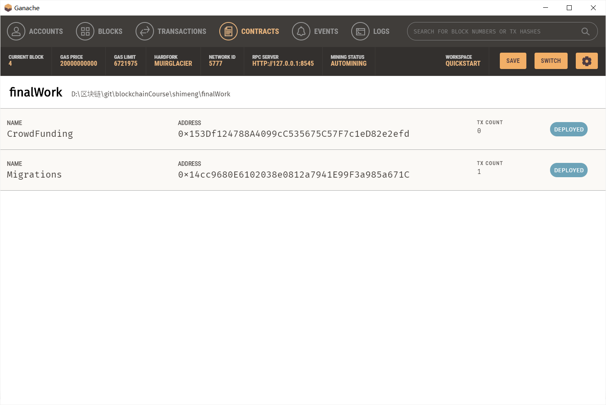

## 如何运行

1. 首先需要配置好`node`、`npm`、`yarn`，安装`ganache`，`chrome`，`chrome`安装插件`MetaMask`
2. 安装 truffle，`yarn global add truffle`
3. 打开`ganache`软件
4. 在`ganache`软件上选择 quickstart，单击右上角齿轮图标进行设置
5. 在 workspace 标签页中 add project 选中 `./truffle-config.js`，server 标签卡将端口改为8545。
6. 单击右上角 save and restart。
7. 选中 ganache 软件中最上面 contracts 选项卡，将 crowdFunding 合约的地址复制，找到`./crowdfunding/src/api/contract.ts`文件的第7行，将 0x 开头的地址覆盖为刚刚复制的地址。
8. 切换到 finalWork 文件夹下
9. 输入：`truffle compile`
10. 输入：`truffle migrate`
11. 将`./build/contracts/CrowdFunding.json`复制到`./crowdfunding/src/api/`目录下
12. 切换到`./crowdfunding/`目录下
13. 输入：`yarn`
14. 安装完毕后输入：`yarn serve`
15. 浏览器中访问：`http://localhost:8080`
16. 在`metamask`中选择连接 localhost:8545 的本地网络，并且从 ganache 中导入几个账户进去，就可以开始测试了。

## 成功界面截图

